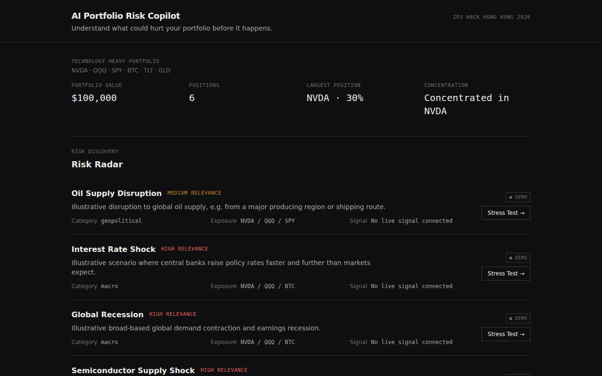
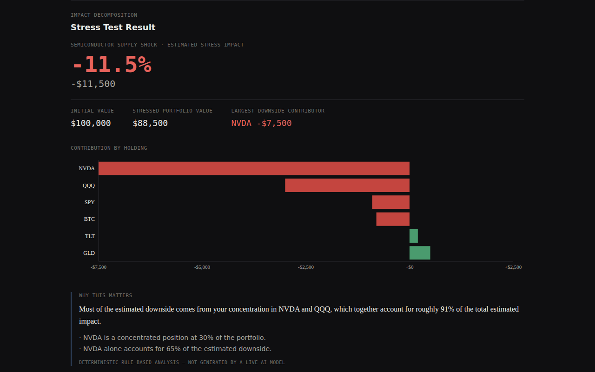

# AI Portfolio Risk Copilot

> Markets tell you what is happening. Prediction markets tell you what
> might happen. We tell you what it could mean for your portfolio.

An AI-assisted **portfolio risk intelligence and stress-testing** tool.
Not a stock picker. Not a trading bot. It answers one question: *what
could go wrong, how exposed am I, and why?*

Built for **iFX Hack Hong Kong 2026** (2026-10-04).

## What it does

Pick a risk (or describe one in plain English), see how it transmits
through markets to your specific holdings, and get a deterministic,
auditable estimate of the impact — down to which position drives the
damage.

## Why it exists

Most investors are shown thousands of risk headlines and no way to know
which ones actually matter to *their* portfolio. This turns a risk signal
into a concrete, explainable number, without pretending to predict the
future.

## Demo workflow



1. Start from the demo Technology Heavy Portfolio.
2. Browse the **Risk Radar** — five illustrative scenarios and one
   verified historical benchmark (real 2022 asset returns), each scored
   for relevance to this specific portfolio.
3. Pick one (or type `"What if oil rises 40% and Nasdaq falls 15%?"` into
   the scenario builder).
4. Inspect and edit the scenario's transmission chain and asset
   assumptions.
5. Run the stress test.



6. See estimated impact, stressed portfolio value, a per-asset
   contribution chart, and a deterministic "why this matters" note.

Full walkthrough: `docs/DEMO_SCRIPT.md`.

## Architecture summary

```
Risk Sources → Risk Discovery → Portfolio Relevance → Scenario Builder
  → Stress Engine → Impact Decomposition → AI Explanation → User Decision
```

React/TypeScript frontend, FastAPI/Python backend, JSON/CSV data files (no
database in v0). AI only ever *interprets* scenarios into structured
assumptions; a deterministic Python engine does all the math. Full detail
and diagram: `docs/ARCHITECTURE.md`.

**AI Risk Committee:** three analyst agents on models from different labs
(GPT-6.1 Sol, Gemini Pro, Kimi K3) assess a scenario independently, and
Claude Opus 5.5 chairs and reconciles them into consensus assumptions and
portfolio insights. How it's orchestrated, why these models, benchmarks
and guard rails: `docs/MULTI_AGENT_ORCHESTRATION.md`.

## Quick start

```bash
git clone <this repo>
cd portfolio-risk-copilot   # or whatever you cloned it as
make setup
make dev
```

Frontend: http://localhost:5173 · API: http://localhost:8000 · Swagger:
http://localhost:8000/docs

No API keys or external credentials required — see Principle 4 in
`AGENTS.md`.

## Repository map

```
apps/web/            React + TypeScript + Vite + Tailwind + Recharts dashboard
apps/api/            FastAPI backend (schemas, domain logic, services, integrations)
data/                Demo portfolio + scenario JSON — edit without touching Python
docs/                Architecture, product, data-source, and process documentation
scripts/             bootstrap.sh / dev.sh / smoke_test.sh
docker-compose.yml   Runs api + web as containers — see docs/DEPLOYMENT.md
```

New here? Read `START_HERE.md` — five minutes to being useful. Deploying
to a server? Read `docs/DEPLOYMENT.md`.

## Current capabilities

See `docs/CURRENT_STATE.md` for the authoritative, kept-current list.
Today: demo portfolio with real price history (Yahoo Finance), 6 demo
scenarios (5 illustrative + 1 verified historical benchmark), deterministic
stress engine, impact decomposition, risk radar, "what if" scenario
parsing (rule-based offline, Claude Sonnet 5.5 live), AI shock estimation,
the multi-model AI Risk Committee, and Polymarket risk discovery
(`ENABLE_POLYMARKET=true`). Everything still works offline by default
(`AI_PROVIDER=mock`). Bedrock and news ingestion are designed-for
but not implemented (see the TODO stubs in `apps/api/app/integrations/`).

## Roadmap

`ROADMAP.md` — pre-hackathon plan (Sep 30 – Oct 3) and the Oct 4 hackathon
day schedule, with P0/P1/P2 priorities.

## Team workflow

Short-lived branches (`feature/*`, `fix/*`, `data/*`, `docs/*`), small PRs,
no heavyweight review process. See `CONTRIBUTING.md`.

## Data integrity disclaimer

All demo scenario numbers are **illustrative assumptions**, not forecasts,
not guaranteed outcomes, and not sourced from real market data unless
explicitly marked `source_status: "verified"` with a real
`source_name`/`source_url`/`source_date`. The UI visually distinguishes
DEMO / VERIFIED / LIVE data everywhere it's shown. See
`docs/DATA_SOURCES.md`.

## Screenshots

See the demo workflow above, and `docs/screenshots/` for more.

## Hackathon context

Built in the run-up to and during iFX Hack Hong Kong 2026
(Asia/Hong_Kong). See `docs/HACKATHON_RULES_CHECK.md` for the note on
pre-built-code disclosure.
