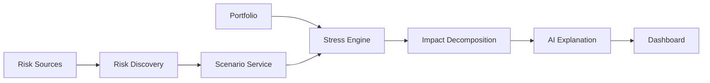
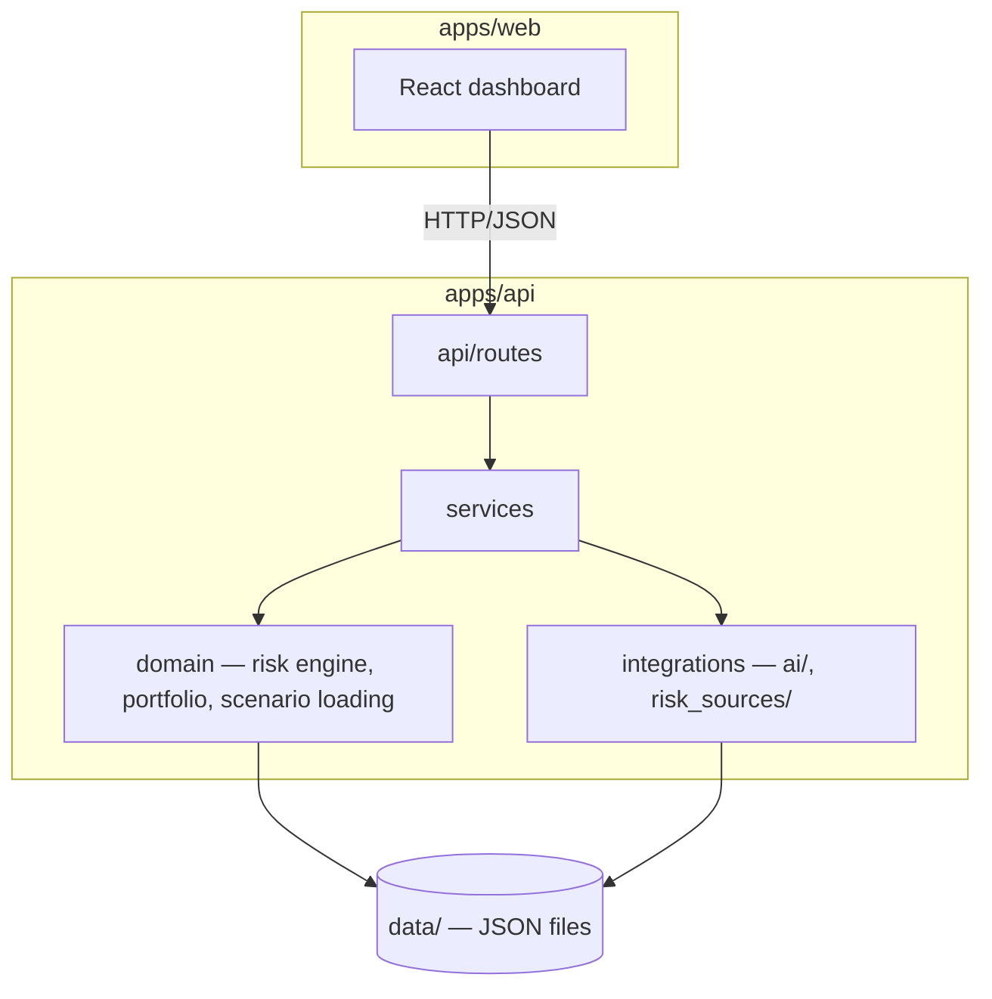

# Architecture

## Product loop

The platform stops at the dashboard. No step automatically acts on the
user's behalf — see `docs/PRODUCT.md` for why.

## System shape

## Module responsibilities

| Module | Responsibility | Must NOT do |
| --- | --- | --- |
| `apps/api/app/schemas/` | Pydantic models = the API contract | Contain logic |
| `apps/api/app/domain/risk/engine.py` | Deterministic stress math (`StressEngine` / `DirectAssetShockEngine`) | Call an LLM, do I/O |
| `apps/api/app/domain/portfolio/` | Portfolio-shape helpers (concentration) | Duplicate engine math |
| `apps/api/app/domain/scenarios/loader.py` | Load scenario JSON files into `Scenario` models | Know about HTTP |
| `apps/api/app/services/` | Orchestrate domain + integrations for a use case (`stress_test_service`, `scenario_service`, `risk_radar_service`, `portfolio_service`) | Contain the actual math |
| `apps/api/app/integrations/ai/` | `ScenarioAIProvider`: text → structured `Scenario` assumptions | Compute portfolio impact |
| `apps/api/app/integrations/risk_sources/` | `RiskSource`: produce `RiskSignal`s with provenance | Fabricate data |
| `apps/api/app/api/routes/` | HTTP layer: request/response, status codes | Contain business logic |
| `apps/web/src/lib/apiClient.ts` | The only place that knows API URLs/fetch details | — |
| `apps/web/src/features/*` | One folder per product area, own components + hooks | Reach into another feature's internals |
| `apps/web/src/types/*` | Mirrors `apps/api/app/schemas/*` exactly | Diverge from the backend contract |

## Why deterministic math, not an LLM

An LLM is good at turning "oil rises 40%" into structured numbers. It is
not something you want computing a portfolio's dollar exposure — it isn't
auditable, isn't reproducible, and can't be unit tested the way
`DirectAssetShockEngine` can. See `docs/DECISIONS.md`.

## Engine extensibility

`StressEngine` is an abstract base so a v1 `FactorStressEngine` (equity
market / technology / rates / oil / USD / gold / crypto factor betas) can
be added later without touching callers — see the stub and TODO in
`apps/api/app/domain/risk/engine.py`. Not implemented for the hackathon
MVP; don't build it before P0 is demo-stable (`ROADMAP.md`).

## Data flow for a stress test

1. Frontend sends `{ portfolio, custom_shocks }` (or `scenario_id`) to
   `POST /api/stress-test`.
2. `stress_test_service` resolves the scenario (if `scenario_id`) via
   `scenario_service`, or uses `custom_shocks` directly.
3. `DirectAssetShockEngine.run()` computes per-asset impact, total impact,
   concentration notes, and a deterministic explanation — pure function,
   no I/O.
4. The `StressTestResult` is returned as-is; the frontend only formats and
   charts it.

## Offline-first

`AI_PROVIDER=mock` and `LocalRiskSource` are the defaults everywhere. Every
live integration point (`bedrock.py`, `polymarket.py`, `news.py`,
`institutional.py`) either isn't wired up yet or fails with a caught,
specific exception (`AIProviderUnavailableError`) rather than crashing the
app — see Principle 4 in `AGENTS.md`.
