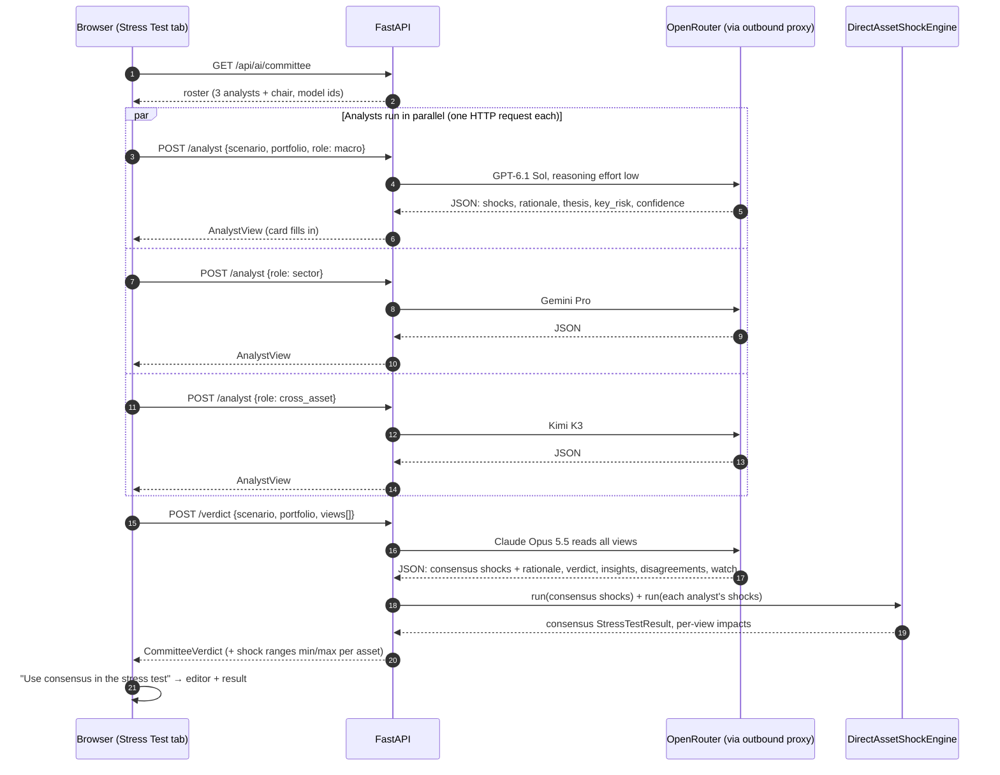

# Multi-Agent Orchestration: the AI Risk Committee

How AI Portfolio Risk Copilot uses several LLMs from different labs to turn
a risk scenario into portfolio-specific assumptions, while every portfolio
number stays deterministic and auditable.

> **One-line pitch:** one model gives you false confidence. Four models
> from four labs, arguing independently and reconciled by a chair, show
> you both the consensus *and* how uncertain it is. The math stays out of
> the LLMs entirely.

---

## 1. The three AI features

| Feature | Where in the UI | Models | Typical latency | Cost / run |
| --- | --- | --- | --- | --- |
| **"What if…?" parser** | Stress Test → "What if…?" | 1 × Claude Sonnet 5.5 | ~6 s | ~$0.005 |
| **Estimate shocks with AI** | Stress Test → scenario editor | 1 × Claude Sonnet 5.5 | ~6 s | ~$0.005 |
| **AI Risk Committee** | Stress Test → "Convene the committee" | 3 analysts + 1 chair | ~25 s | ~$0.04 |

All three go through OpenRouter (`AI_PROVIDER=openrouter`). With
`AI_PROVIDER=mock` (the default), the app keeps working offline: the
"What if…?" box falls back to the rule-based parser, and the AI buttons and
committee are hidden.

---

## 2. Committee roster

| Seat | Lens | Model | Lab |
| --- | --- | --- | --- |
| **Macro & Rates Strategist** | Top-down: central banks, inflation, real yields, the dollar | `openai/gpt-6.1-sol` | OpenAI |
| **Sector & Earnings Analyst** | Bottom-up: revenues, margins, supply chains, valuation multiples | `~google/gemini-pro-latest` | Google |
| **Cross-Asset & History Specialist** | Historical analogues, bond duration math, gold and crypto flows | `moonshotai/kimi-k3` | Moonshot |
| **Committee Chair** | Reconciles the three, writes the portfolio takeaways | `anthropic/claude-opus-5.5` | Anthropic |

Why different labs: models trained by the same lab tend to share blind
spots. Diversity of training data and post-training is what makes the
spread between analysts informative instead of noise around one prior.

Why different lenses: even with diverse models, an identical prompt pulls
answers toward the middle. A distinct role per seat produces genuinely
different arguments. For example, on an oil shock the history specialist
anchored on the Feb–Mar 2022 oil spike while the macro seat reasoned from
real yields. The chair then has something real to reconcile.

---

## 3. Orchestration flow



Design choices:

- **Fan-out happens in the browser, not the server.** Each analyst is its
  own request, so each card renders the moment its model answers. The
  audience watches the committee "report in" instead of staring at one
  25-second spinner. It also keeps the API stateless: no job queue, no
  SSE, no websockets.
- **The chair only sees what succeeded.** If one analyst fails (timeout,
  provider error), the chair reconciles the remaining two and the failed
  card shows the error. Zero successful analysts means no verdict call.
- **Stale runs are discarded.** Each "Convene" gets a run id. Results that
  arrive after the user switched scenario or re-convened are dropped.

---

## 4. What the LLMs produce vs what the engine computes

This boundary is the core architectural rule (Principle 2 in `AGENTS.md`).

| Produced by an LLM (assumptions and commentary) | Computed by the deterministic engine (numbers) |
| --- | --- |
| Per-asset price shocks (each analyst + consensus) | Portfolio impact of the consensus, in % and $ |
| One-line rationale per asset | Portfolio impact of **each analyst's** view |
| Analyst thesis, tail risk, confidence | Per-asset shock range (min/max across analysts) |
| Chair verdict, 3 insights, disagreements, signals to watch | Contribution by holding, concentration notes |

The "Portfolio impact by model" bars, the range table and the headline
consensus impact are all engine output. If a chair sentence quotes a
number, it is the chair's estimate. The authoritative figure is the
engine's figure next to it (in practice they matched in every live run).

---

## 5. Prompts (summary)

Source: `apps/api/app/integrations/ai/committee.py` and
`apps/api/app/integrations/ai/openrouter.py`.

**Analyst prompt** gives:
- the seat's label and lens;
- the six assets, each with a one-line description;
- the portfolio's holdings and weights;
- the scenario: title, description, horizon, transmission chain.

It asks the model to be independent and specific ("do not hedge
everything to the middle") and to return **only JSON**:

```json
{
  "asset_shocks": {"NVDA": -0.22, "QQQ": -0.10, "...": 0},
  "rationale": {"NVDA": "one short sentence", "...": "..."},
  "thesis": "at most 2 sentences",
  "key_risk": "what would make this materially worse",
  "confidence": "low | medium | high"
}
```

**Chair prompt** gives the same context plus all analyst views as JSON. It
tells the chair to:
- weigh arguments, not just average them;
- name where analysts split and which side it leans to;
- describe risk only, and never recommend buying, selling or hedging.

It returns consensus `asset_shocks` and `rationale` (how each asset was
reconciled), plus `verdict`, exactly 3 `insights` about this portfolio,
`disagreements`, `watch` and `confidence`.

---

## 6. Guard rails

| Risk | Mitigation |
| --- | --- |
| Model invents a symbol | `clean_shocks()` keeps only the 6 supported symbols |
| Absurd magnitude (e.g. `-5` instead of `-0.05`) | Shocks outside −95%…+200% are dropped |
| Markdown-fenced or chatty JSON | Code fences stripped; non-object replies rejected |
| Bad enum (`"very high"`) | Confidence coerced to `medium` |
| Over-long text | Thesis, rationale and insights truncated server-side |
| Hallucinated portfolio maths | All impacts recomputed by the engine (section 4) |
| AI output mistaken for data | Always `source_status: "illustrative"`; UI labels "AI-estimated, not a forecast" |
| Investment-advice drift | Chair prompt forbids buy/sell/hedge recommendations; UI disclaimer |
| Provider down, out of credits, region-blocked | HTTP 401/402/403/429 mapped to actionable messages; 503 to the UI; rest of app unaffected |
| OpenRouter blocks the server's IP (Russia) | API container uses `HTTPS_PROXY` → tinyproxy on the Hostkey US VM, allowlisted to the Timeweb IP |

---

## 7. How the models were chosen (benchmark, 2026-10-04)

The same `_ESTIMATE_PROMPT` was run on each model for the "Semiconductor
Supply Shock" and "Interest Rate Shock" scenarios. Every model returned
valid JSON with all 6 assets and 6 rationales.

| Model | Latency (default → effort `low`) | Cost / call | Notes |
| --- | --- | --- | --- |
| `anthropic/claude-opus-5.5` | 7.0 s → 5.8 s | ~$0.010 | Best reconciliation; cites duration and real yields → **chair** |
| `anthropic/claude-sonnet-5.5` | 5.8 s | ~$0.005 | Cites specific episodes (2022 export controls, Aug-2024) → **single-model default** |
| `openai/gpt-6.1-sol` | 25.8 s → 7.9 s | ~$0.004 | Strong on rates and inflation → **macro seat** |
| `~google/gemini-pro-latest` | 13.0 s → 8.9 s | ~$0.012–0.018 | Most aggressive on tech (NVDA −30%) → **sector seat** |
| `moonshotai/kimi-k3` | 5.6 s | ~$0.003 | Names historical analogues (2008, 2020, 2022 oil) → **cross-asset seat** |
| `x-ai/grok-4.7` | 28 s → 13–37 s | ~$0.007–0.014 | Excellent duration math, but too slow and variable for a live demo |
| `google/gemini-3.8-flash` | 5–9 s | ~$0.004 | Good; Google seat already taken by Pro |
| `deepseek/deepseek-v4-pro` | 16–39 s | <$0.001 | Cheapest, but too slow |
| `qwen/qwen3.8-max-0902` | 28 s | ~$0.006 | Solid, slow |

Spread on the semiconductor scenario alone: NVDA from −15% (Grok) to −30%
(Gemini Pro), TLT from +2% to +8%. That spread is exactly what the
committee surfaces instead of hiding.

All calls use `reasoning: {effort: "low"}`. On reasoning models this
cut latency 2–3× with no visible quality loss for this task.

### Live results (production, 2026-10-04)

| Scenario | Analysts (parallel) | Chair | Total | Per-model impact | Consensus |
| --- | --- | --- | --- | --- | --- |
| Semiconductor Supply Shock | 13 s | 12 s | 25 s | −11.6% / −12.6% / −12.8% | **−12.1%** |
| Oil Supply Disruption | ~19 s | ~11 s | ~30 s | −8.3% / −7.5% / −13.1% | **−8.9%** |

Example chair insight (oil scenario): *"QQQ 25% and SPY 15% overlap
heavily with NVDA's mega-cap tech exposure, so the 70% equity sleeve
behaves almost as one rate-sensitive position."*

---

## 8. Cost

At ~$0.04 per committee run and ~$0.005 per single-model call, a $50
OpenRouter balance covers roughly 1,000+ committee sessions. Check the
balance:

```bash
curl -s https://openrouter.ai/api/v1/credits -H "Authorization: Bearer $OPENROUTER_API_KEY"
```

A 402 from OpenRouter shows in the UI as "The OpenRouter account is out of
credits — top it up…".

---

## 9. Configuration

All model ids are settings in `apps/api/app/core/config.py` and can be
overridden with environment variables (`.env` locally, or the deploy
workflow's `.env` on the server):

| Env var | Default |
| --- | --- |
| `AI_PROVIDER` | `mock` (production: `openrouter`) |
| `OPENROUTER_API_KEY` | (secret) |
| `OPENROUTER_MODEL` | `anthropic/claude-sonnet-5.5` (single-model features) |
| `COMMITTEE_MACRO_MODEL` | `openai/gpt-6.1-sol` |
| `COMMITTEE_SECTOR_MODEL` | `~google/gemini-pro-latest` |
| `COMMITTEE_CROSS_ASSET_MODEL` | `moonshotai/kimi-k3` |
| `COMMITTEE_CHAIR_MODEL` | `anthropic/claude-opus-5.5` |
| `HTTPS_PROXY` | unset; production: `http://82.38.69.22:8888` |

To swap a seat, set the env var to any OpenRouter model id. No code
change is needed. Re-run the benchmark first: latency varies a lot
between providers.

---

## 10. API surface

Full shapes are in `docs/API_CONTRACT.md`.

| Method | Path | Purpose |
| --- | --- | --- |
| `GET` | `/api/ai/status` | Is a live LLM configured? (UI shows or hides AI controls) |
| `POST` | `/api/ai/parse-scenario` | Free text → full scenario with rationale |
| `POST` | `/api/ai/estimate-shocks` | Re-estimate an existing scenario's shocks |
| `GET` | `/api/ai/committee` | Committee roster |
| `POST` | `/api/ai/committee/analyst` | One analyst's view |
| `POST` | `/api/ai/committee/verdict` | Chair consensus + engine-computed numbers |

---

## 11. Code map

```
apps/api/app/
  integrations/ai/openrouter.py   chat_json() helper, prompts, clean_shocks/clean_rationale,
                                  OpenRouterScenarioProvider (parse + estimate)
  integrations/ai/committee.py    roles, lenses, analyst/chair prompts, run_analyst, run_chair
  services/committee_service.py   build_verdict(): chair + engine runs + ranges
  api/routes/committee.py         /api/ai/committee endpoints
  schemas/committee.py            CommitteeRoster, AnalystView, CommitteeVerdict, ...
  tests/test_committee.py         prompt wiring, cleaning, engine-computed numbers, 503 on mock

apps/web/src/features/committee/
  useCommittee.ts                 parallel fan-out, per-seat state, stale-run guard, chair call
  CommitteePanel.tsx              analyst cards, chair card, impact spread, range table
```

---

## 12. Ideas for later

- **Debate round:** give each analyst the others' views for one rebuttal
  before the chair speaks.
- **Live context:** feed Polymarket probabilities and recent price moves
  (already fetched for the Performance chart) into the analyst prompts.
- **Calibration:** run the committee on the verified 2022 scenario
  description *without* the real returns, and score each seat against
  what actually happened.
- **Streaming:** stream the chair's verdict token by token for a faster
  first paint.
