# Design: Real-Time Risk Monitor and Scenario Library Expansion

Status: **proposal** (2026-10-04). Nothing here is built yet, except where it says
"exists today". Decisions that change the architecture (a persistent store,
a background worker) are called out explicitly. Per `AGENTS.md`, they need team
agreement before implementation.

**Goal:** continuously collect news and official events about the assets we
hold, from trustworthy sources. Decide deterministically which events matter for
*this* portfolio, and immediately propose a stress scenario the user can run in
one click (and optionally send to the AI Risk Committee).

```
Sources → Ingest → Normalize & dedupe → Tag (assets, risk factors) → Score relevance
       → Classify (AI, labelled) → Map to scenario → Stress engine → Alert feed
```

---

## 1. Principles carried over (non-negotiable)

1. **Provenance on everything.** Every event shows its source, original URL,
   publication time and retrieval time. No paraphrased headline is ever
   shown as if it were the original.
2. **Source tiers are visible.** A Fed statement and a Motley Fool listicle are
   not equal. The tier is shown in the UI and used in scoring.
3. **AI interprets, code calculates.** LLMs may classify an event and draft a
   scenario (always `illustrative`, citing the event). Relevance scores,
   portfolio impacts and alert thresholds are deterministic.
4. **Degrade, never fabricate.** If a source is down, the feed says so. Silence
   is preferable to invented events.
5. **No investment advice.** Alerts describe exposure and scenarios, never
   "sell X".
6. **Respect licences.** Store and show headlines and links, not article
   bodies. Paid feeds' redistribution terms apply to the live demo.

---

## 2. Data sources

Reachability was tested from the production VM (Timeweb, Russia) on
2026-10-04. "Proxy" means it only works through the Hostkey US tinyproxy
(`HTTPS_PROXY`), which the API container already uses.

### Tier 1: primary and official (free, highest trust)

| Source | What it gives us | Access | From prod | Assets / factors |
| --- | --- | --- | --- | --- |
| **SEC EDGAR** (`efts.sec.gov`, `data.sec.gov`, "current filings" Atom) | 8-K material events, 10-Q/K, Form 4 insider trades, minutes after filing | Free, no key, descriptive User-Agent, ≤10 req/s | ✅ direct | NVDA, JPM, XOM, LMT, TSM (6-K/20-F) |
| **Federal Reserve** press RSS (`federalreserve.gov/feeds`) | FOMC statements, bank regulation, enforcement | Free RSS | ✅ direct | Rates → TLT, BIL, VNQ, JPM, QQQ |
| **ECB** press RSS | Euro-area policy | Free RSS | ✅ proxy | Rates, USD |
| **BLS** latest releases RSS | CPI, jobs: inflation and growth shocks | Free RSS | ✅ proxy | Rates, inflation → TLT, GLD |
| **EIA** (Today in Energy, weekly petroleum) | Oil and gas supply and inventories | Free RSS / API key | ✅ direct | XOM, oil-shock scenarios |
| **Company press releases** via GlobeNewswire / Business Wire / PR Newswire RSS | Earnings, guidance, M&A, straight from the issuer | Free RSS (headline + link) | ✅ proxy (GlobeNewswire) | All single stocks |
| **Federal Register API** (BIS export controls, OFAC sanctions) | Chip export rules, sanctions | Free API | not yet tested | NVDA, TSM, FXI, "US-China" factor |

### Tier 2: licensed real-time newswires (paid, ticker-tagged)

| Source | Notes | Indicative price |
| --- | --- | --- |
| **Benzinga via Massive (ex-Polygon)** | ~25 ms WebSocket, analyst actions, ticker-tagged | Real-time from the $199/mo Advanced plan; Starter and Developer plans are delayed |
| **Finnhub** | News, sentiment, calendars, WebSocket; usable free tier (60 calls/min) | Free tier; Essential $166/mo |
| **LSEG / Reuters Machine Readable News** | Gold standard: Reuters + wires, NLP tags | Enterprise, quote only |
| **Dow Jones Newswires** | Same class as Reuters | Enterprise, quote only |

### Tier 3: aggregators and global monitoring

| Source | Notes | Price |
| --- | --- | --- |
| **Yahoo Finance search** (exists today) | Ticker-tagged headlines; unofficial; mixed quality (Motley Fool, Zacks…) | Free |
| **Marketaux** | 200k+ entities, per-entity sentiment | Free 100 req/day; from $29/mo |
| **Alpha Vantage News & Sentiment** | Ticker-tagged, sentiment scores | Free 25 req/day; from $49.99/mo |
| **NewsAPI.ai (Event Registry)** | Clusters articles into *events*, history since 2014 | From $90/mo |
| **GDELT 2.0** | Global geopolitics in 100+ languages, updated every 15 min | Free. The DOC API is throttled to 1 req per 5 s (we hit 429 from prod), so use the 15-min export files instead |

### Tier 4: market-implied signals (not news, but the best "is this real?" check)

| Source | Use | From prod |
| --- | --- | --- |
| **Polymarket Gamma** (exists today) | Probabilities. `tag_slug=economy` returns relevant markets, e.g. "Fed Decision in October?" and "Strait of Hormuz traffic returns to normal by Dec 31?". This also fixes today's "0 signals" problem | ✅ direct |
| **Kalshi** (CFTC-regulated) | Economics markets (CPI, Fed, recession); public read API, no key | ✅ proxy (403 direct) |
| **Yahoo prices** (exists today) | Abnormal-move detector: an asset moving more than k·σ triggers "what's moving it?" | ✅ |

### Recommendation

- **Hackathon / demo stack (free, $0):** EDGAR + Fed/BLS/EIA/ECB RSS +
  GlobeNewswire RSS + Yahoo headlines + Polymarket (tag-based) + Kalshi + Yahoo
  price-move triggers. This is enough to show real events in real time with
  real provenance.
- **First paid upgrade (~$166–199/mo):** Finnhub Essential *or* Massive
  Advanced (Benzinga). Either gives a single ticker-tagged real-time stream
  with a licence, so we can drop most scraping.
- **Enterprise:** LSEG MRN or Dow Jones, once there are paying users.

---

## 3. Architecture

```mermaid
flowchart LR
  subgraph Sources
    A1[EDGAR 8-K/Form 4]:::t1
    A2[Fed / ECB / BLS / EIA RSS]:::t1
    A3[Issuer press-release RSS]:::t1
    B1[Finnhub / Benzinga - later]:::t2
    C1[Yahoo headlines]:::t3
    C2[GDELT 15-min export]:::t3
    D1[Polymarket / Kalshi]:::t4
    D2[Yahoo price moves]:::t4
  end

  subgraph Monitor worker
    I[Connectors<br/>poll / stream] --> N[Normalize<br/>RawItem]
    N --> DD[Dedupe & cluster<br/>URL hash + title similarity]
    DD --> T[Tag<br/>tickers + risk factors]
    T --> R[Relevance score<br/>deterministic]
    R -->|above threshold| CL[Classify<br/>cheap LLM, labelled]
    CL --> M[Map to scenario<br/>library match or AI draft]
    M --> S[Stress engine<br/>impact for this portfolio]
  end

  Sources --> I
  S --> DB[(Event store<br/>SQLite)]
  DB --> API[FastAPI<br/>/api/events, /api/events/stream SSE]
  API --> UI[Risk Feed UI<br/>alerts → one-click stress test / committee]

  classDef t1 fill:#1f3b2b,stroke:#4A9B6E,color:#EDEBE6
  classDef t2 fill:#1f2b3b,stroke:#5C8AC7,color:#EDEBE6
  classDef t3 fill:#3b331f,stroke:#C48A32,color:#EDEBE6
  classDef t4 fill:#2b1f3b,stroke:#8C7BD6,color:#EDEBE6
```



### 3.1 Components

| Component | Where | Notes |
| --- | --- | --- |
| Connectors | `apps/api/app/integrations/feeds/{edgar,fed,bls,eia,newswire,yahoo,polymarket,kalshi,gdelt}.py` | One file per source behind a `FeedConnector` interface: `poll(since) -> list[RawItem]`. Each declares `tier`, `poll_interval`, `needs_proxy`. Same rules as the existing `integrations/news/`: validate, time out, never invent. |
| Monitor worker | new `apps/api/app/monitor/` + a `monitor` service in `docker-compose.yml` (same image, different command) | asyncio loop with per-connector schedules (EDGAR 60 s, RSS 2–5 min, Polymarket and Kalshi 5 min, prices 5 min in market hours). **New architecture: background process.** |
| Event store | SQLite file on a Docker volume | **New architecture: first persistence.** SQLite keeps it to zero infra; Postgres later if multi-user. |
| Feed API | `GET /api/events?portfolio_id=&since=`, `GET /api/events/stream` (Server-Sent Events), `POST /api/events/{id}/scenario` | SSE works through the existing nginx with `proxy_buffering off`. |
| Risk Feed UI | new `apps/web/src/features/risk-feed/` + a badge in the header | Live list of alerts, filters by tier and asset, one click into Stress Test / Committee. |

### 3.2 Data model

```text
RawItem      id, source, tier, url, title, published_at, retrieved_at, raw_tickers[], body_hash
Event        id, cluster_key, first_seen, last_seen, headline (verbatim, best tier),
             sources[RawItem ids], tickers[], risk_factors[], tier (best of sources)
Assessment   event_id, portfolio_id, relevance (0-1, deterministic), held_exposure[{symbol, weight, direction}],
             classification{category, severity, novelty} + model + "AI-generated" flag,
             suggested_scenario{scenario_id | drafted Scenario}, stress_result (engine),
             created_at
```

### 3.3 Tagging (deterministic first)

1. **Tickers:** explicit tags from the source (EDGAR CIK → symbol, Yahoo
   `relatedTickers`, Finnhub/Benzinga tickers), plus an exact-match alias
   table (`"Taiwan Semiconductor"`, `"TSMC"` → TSM).
2. **Risk factors:** map to the `risk_factors` already in
   `data/assets/supported_assets.json`. A new file
   `data/risk_factors.json` defines each factor once, with keywords, the
   affected assets and the direction:

```json
{
  "id": "taiwan-geopolitics",
  "label": "Taiwan geopolitical risk",
  "keywords": ["Taiwan Strait", "PLA drills", "blockade", "TSMC fab"],
  "assets": {"TSM": -1, "NVDA": -1, "QQQ": -1, "FXI": -1, "GLD": 1, "TLT": 1},
  "scenario_ids": ["taiwan-strait-blockade", "semiconductor-supply-shock"]
}
```

3. LLM tagging is used only as a fallback for untagged tier-1 items (e.g. a Fed
   release). Its output is cleaned like `clean_shocks()`: known
   factors only.

### 3.4 Relevance score (deterministic, explainable)

```
relevance = tier_weight × novelty × Σ_assets( portfolio_weight(asset) × |direction| ) × recency_decay
```

- `tier_weight`: T1 1.0, T2 0.9, T4 0.8, T3 0.5. A single tier-3 article
  can't trigger an alert alone; a cluster with ≥2 independent publishers can.
- `novelty`: 1.0 for a new cluster, decaying as the same story repeats.
- **Triggers:** relevance ≥ threshold; or a T4 signal moves (a Polymarket
  probability changes by >10 pts in 24 h, or a held asset moves >2.5σ
  intraday). The UI shows *why* the alert fired.

### 3.5 Event → scenario

1. **Library match (deterministic):** the factor's `scenario_ids` give
   candidate scenarios. They are ranked by the stress engine's impact on this
   portfolio, and the top one is suggested along with its impact.
2. **No match:** the LLM drafts a scenario from the event (existing
   `parse_scenario` path). It is `illustrative`, its `source_name` names the
   event, and its transmission chain cites the source URL. One click runs the
   stress test; another sends it to the AI Risk Committee.
3. **Live-informed probability:** when a Polymarket or Kalshi market matches,
   its real probability is shown next to the scenario (`source_status:
   "live"` for the probability only; the shocks stay illustrative).

### 3.6 Cost and limits (free stack)

| Item | Load |
| --- | --- |
| EDGAR | ~1 req/min |
| RSS | ~10 feeds × 1 req / 2–5 min |
| Yahoo | 15 tickers × 1 req / 10 min |
| LLM classification | Only above threshold. With a cheap model (e.g. `google/gemini-3.8-flash`, ~$0.004/call), on the order of $1/day at 200 alerts |

---

## 4. Scenario library expansion

### 4.1 Verified historical scenarios (real data, computed 2026-10-04)

These are total returns from Yahoo adjusted closes over the window shown,
across all 15 supported assets. All are feasible today with the existing
`integrations/market_data/yahoo.py`. Each would ship as `source_status:
"verified"` with a research note, like the 2022 scenario.

| Scenario | Window | SPY | QQQ | NVDA | TSM | JPM | XOM | XLV | LMT | FXI | VNQ | TLT | HYG | BIL | GLD | BTC |
| --- | --- | ---: | ---: | ---: | ---: | ---: | ---: | ---: | ---: | ---: | ---: | ---: | ---: | ---: | ---: | ---: |
| COVID crash | 2020-02-19 → 03-23 | -34 | -28 | -32 | -21 | -43 | -48 | -28 | -36 | -19 | -42 | +14 | -22 | 0 | -4 | -33 |
| SVB banking stress | 2023-03-08 → 03-17 | -2 | +3 | +6 | -1 | -9 | -9 | 0 | -3 | -3 | -6 | +5 | -1 | 0 | +9 | +26 |
| Russia–Ukraine invasion | 2022-02-16 → 03-08 | -7 | -9 | -19 | -19 | -17 | +12 | -2 | +17 | -18 | -1 | +2 | -2 | 0 | +10 | -12 |
| Yen carry-trade unwind | 2024-07-31 → 08-05 | -6 | -8 | -14 | -11 | -8 | -3 | -2 | +1 | -3 | -2 | +5 | -1 | 0 | -2 | -16 |
| April 2025 tariff shock | 2025-04-02 → 04-08 | -12 | -13 | -13 | -17 | -11 | -15 | -8 | -2 | -17 | -12 | -3 | -4 | 0 | -4 | -8 |
| Q4 2018 selloff | 2018-10-03 → 12-24 | -19 | -23 | -56 | -20 | -19 | -23 | -15 | -29 | -6 | -8 | +6 | -6 | 0 | +6 | -37 |
| China devaluation | 2015-08-10 → 08-25 | -11 | -12 | -14 | -13 | -13 | -12 | -10 | -6 | -16 | -8 | +1 | -2 | 0 | +3 | -16 |
| GFC: Lehman → trough | 2008-09-12 → 2009-03-09 | -45 | -41 | -19 | -15 | -61 | -16 | -32 | -50 | -36 | -64 | +11 | -29 | 0 | +20 | n/a |

(% total return, rounded.) **Schema change needed:** BTC didn't exist in 2008.
Today every scenario must shock every asset (enforced by a test). Proposal:
allow `null` for "not observable", which the engine reports as
`has_assumption: false` with a visible note, never a silent 0.

What these show in a demo: the multi-asset portfolio's "hedges" behave
differently by regime. XOM and LMT rallied in the Ukraine invasion, gold and BTC
rallied in the SVB stress, and TLT protected in COVID but not in the April 2025
tariff shock.

### 4.2 New forward-looking (illustrative) scenarios, mapped to risk factors

| Scenario id | Trigger factor(s) | Most exposed holdings | Live probability source |
| --- | --- | --- | --- |
| `taiwan-strait-blockade` | Taiwan geopolitics | TSM, NVDA, QQQ, FXI (↓); GLD, TLT, LMT (↑) | Polymarket / Kalshi if listed |
| `strait-of-hormuz-closure` | Oil supply | XOM (↑); SPY, HYG, TSM (↓); GLD (↑) | Polymarket "Hormuz traffic" ✅ found |
| `us-high-yield-credit-event` | Credit spreads, defaults | HYG, JPM, VNQ (↓); TLT, BIL (↑) | |
| `regional-bank-run` | Bank stress (SVB-type) | JPM, VNQ, HYG (↓); GLD, BTC (?) | |
| `ai-capex-bust` | AI investment cycle | NVDA, TSM, QQQ (↓↓); XLV (relative ↑) | |
| `us-term-premium-shock` | Fiscal / Treasury supply | TLT, VNQ (↓↓); BIL (flat) | Kalshi rates markets |
| `fed-emergency-cut` | Fed policy | TLT, GLD, VNQ (↑); BIL yield ↓ | Polymarket / Kalshi "Fed decision" ✅ found |
| `china-property-crisis` | China credit and property | FXI (↓↓), XOM, TSM (↓) | |
| `stagflation` | Inflation + growth | TLT, QQQ (↓); XOM, GLD (↑) | Kalshi CPI |
| `usd-surge` | Dollar | GLD, FXI, BTC (↓) | |
| `defense-spending-surge` | Defence budgets | LMT (↑) | |
| `crypto-exchange-failure` | Crypto market structure | BTC (↓↓) | |
| `us-export-controls-tightening` | US-China export restrictions | NVDA, TSM, FXI (↓) | Federal Register (T1) |

Each gets a JSON file, as today, with all 15 assets shocked and an explicit
transmission chain. Shock sizes can be calibrated against the closest verified
window above (e.g. `regional-bank-run` ← SVB, `us-high-yield-credit-event` ←
COVID/GFC HYG moves). The source of the calibration is recorded in the file.

---

## 5. Delivery plan

| Phase | Scope | New architecture? | Effort |
| --- | --- | --- | --- |
| **0. Scenarios** | 8 verified historical + ~8 illustrative scenarios; `null` = not observable; `data/risk_factors.json` | Schema tweak only | ~0.5 day |
| **1. Polymarket fix** | Tag-based queries (`tag_slug=economy`, geopolitics) + factor matching → Risk Radar finally shows live probabilities | No | ~2 h |
| **2. Monitor MVP (free stack)** | EDGAR + Fed/BLS/EIA RSS + Yahoo + price-move trigger; in-memory store; `/api/events` polling; "Risk Feed" panel with one-click stress test | Background worker in the API process (no DB yet) | ~1 day |
| **3. Persistence + SSE** | SQLite event store, `monitor` container, SSE stream, dedupe and clustering, Kalshi + GlobeNewswire + GDELT export | **Yes**: DB + worker (team decision) | ~2 days |
| **4. Paid feed** | Finnhub or Massive/Benzinga connector; retire most scraping | No | ~0.5 day + subscription |
| **5. Alerts out** | Telegram/email digests, per-user portfolios | Yes (users) | later |

**For today's demo**, Phases 0 and 1 give the biggest visible jump: more
scenarios, verified history and live probabilities on the radar. Phase 2 can
be a single "Risk Feed" panel driven by real EDGAR/Fed/Yahoo items.

---

## 6. Open questions for the team

1. Is adding a database and background worker acceptable (Phase 3), or do we stay
   stateless and in-memory through the hackathon?
2. Budget for one paid feed after the hackathon: Finnhub ($166/mo) or Massive
   Advanced with Benzinga ($199/mo)?
3. Should alerts ever leave the app (Telegram/email)? If so, which events
   qualify? Only tier 1, or anything above the threshold?
4. Confirm the "not observable" (`null`) semantics for historical scenarios
   that predate an asset.

## Sources

- [SEC EDGAR access requirements and rate limits (summary)](https://thenextgennexus.com/2026/06/01/sec-8k-filings-api-material-events-tracker-2026/)
- [Federal Reserve RSS feeds](https://federalreserve.gov/feeds)
- [GDELT 2.0 update frequency and API limits](https://blog.gdeltproject.org/gdelt-reaches-300-million-events/)
- [Kalshi public market-data API](https://www.codex.io/blog/kalshi-api)
- [Financial news API comparison 2026 (Benzinga/Massive, Finnhub, Marketaux pricing)](https://newsdata.io/blog/best-stock-news-api/)
- [Financial market API pricing 2026](https://blog.apilayer.com/12-best-financial-market-apis-for-real-time-data-in-2026/)
- [Alpha Vantage pricing tiers 2026](https://qveris.ai/guides/alpha-vantage-pricing-alternative/)
- [NewsAPI.ai / Event Registry pricing](https://geekflare.com/guides/global-news-api/)
- [LSEG Machine Readable News](https://www.lseg.com/en/data-analytics/financial-data/financial-news-coverage/political-news-feeds-analysis/real-time-news)
- [Newswire RSS coverage (GlobeNewswire, Business Wire, PR Newswire)](https://thenextgennexus.com/2026/05/30/pr-newswire-alternatives-compared-2026/)
