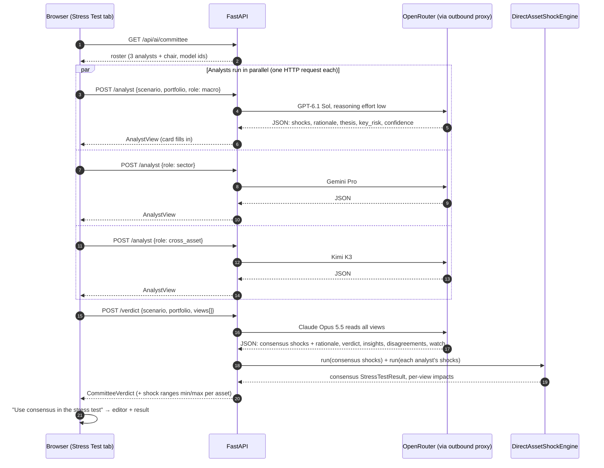

# Multi-Agent Orchestration: the AI Risk Committee

How AI Portfolio Risk Copilot uses several LLMs from different labs to turn
a risk scenario into portfolio-specific assumptions, while every portfolio
number stays deterministic and auditable.

> **One-line pitch:** one model gives you false confidence. Four models
> from four labs, arguing independently and reconciled by a chair, show
> you both the consensus *and* how uncertain it is. The math stays out of
> the LLMs entirely.

---

## 1. The three AI features

| Feature | Where in the UI | Models | Typical latency¹ | Cost / run¹ |
| --- | --- | --- | --- | --- |
| **"What if…?" parser** | Stress Test → "What if…?" | 1 × configured `OPENROUTER_MODEL` (default `anthropic/claude-haiku-4.5`) | ~6 s | ~$0.005 |
| **Estimate shocks with AI** | Stress Test → scenario editor | 1 × configured `OPENROUTER_MODEL` | ~6 s | ~$0.005 |
| **AI Risk Committee** | Stress Test → "Convene the committee" | 3 analysts + 1 chair | ~25 s (~+10 s with debate) | ~$0.04–0.08 |

¹ These figures are rough estimates from informal calls, not metered
bills or a recorded run. The committee's full live end-to-end run is
pending `make smoke-live` (see §7); no measured live-run numbers are
claimed in this document yet.

All three go through OpenRouter (`AI_PROVIDER=openrouter`). With
`AI_PROVIDER=mock` (the default), the app keeps working offline: the
"What if…?" box falls back to the rule-based parser, and the AI buttons and
committee are hidden.

---

## 2. Committee roster

| Seat | Lens | Model | Lab |
| --- | --- | --- | --- |
| **Macro & Rates Strategist** | Top-down: central banks, inflation, real yields, the dollar | `openai/gpt-6.1-sol` | OpenAI |
| **Sector & Earnings Analyst** | Bottom-up: revenues, margins, supply chains, valuation multiples | `~google/gemini-pro-latest` | Google |
| **Cross-Asset & History Specialist** | Historical analogues, bond duration math, gold and crypto flows | `moonshotai/kimi-k3` | Moonshot |
| **Committee Chair** | Reconciles the three, writes the portfolio takeaways | `anthropic/claude-opus-5.5` | Anthropic |

Why different labs: models trained by the same lab tend to share blind
spots. Diversity of training data and post-training is what makes the
spread between analysts informative instead of noise around one prior.

Why different lenses: even with diverse models, an identical prompt pulls
answers toward the middle. A distinct role per seat produces genuinely
different arguments. For example, on an oil shock one seat might anchor
on the Feb–Mar 2022 oil spike while another reasons from real yields. The
chair then has something real to reconcile.

---

## 3. Orchestration flow



Design choices:

- **Fan-out happens in the browser, not the server.** Each analyst is its
  own request, so each card renders the moment its model answers. The
  audience watches the committee "report in" instead of staring at one
  25-second spinner. It also keeps the API stateless: no job queue, no
  SSE, no websockets.
- **The chair only sees what succeeded.** If one analyst fails (timeout,
  provider error), the chair reconciles the remaining two and the failed
  card shows the error. Zero successful analysts means no verdict call.
- **Stale runs are discarded.** Each "Convene" gets a run id. Results that
  arrive after the user switched scenario or re-convened are dropped.
- **The debate round is opt-in and server-side.** With `debate: true` on the
  verdict request, each analyst gets one rebuttal call showing the other
  seats' views anonymized (shocks, rationale, thesis, key risk — never names
  or model ids). Rebuttals run in parallel; a seat whose rebuttal fails
  keeps its first-round view. The chair sees the revisions next to the
  originals and is told to weigh them, not average them. Without the flag
  the committee runs exactly one round.
- **Live Polymarket context is optional.** Pass a tracked `market_id` with
  an analyst or verdict request and the live market-implied probability
  (plus its 7d/30d moves and provenance) is appended to the prompt and
  echoed back as `market_context`. It is omitted silently when no id is
  sent, the market isn't tracked, or Polymarket is unreachable — the
  committee stays fully functional offline.

---

## 4. What the LLMs produce vs what the engine computes

This boundary is the core architectural rule (Principle 2 in `AGENTS.md`).

| Produced by an LLM (assumptions and commentary) | Computed by the deterministic engine (numbers) |
| --- | --- |
| Per-asset price shocks (each analyst + consensus) | Portfolio impact of the consensus, in % and $ |
| One-line rationale per asset | Portfolio impact of **each analyst's** view |
| Analyst thesis, tail risk, confidence | Per-asset shock range (min/max across analysts) |
| Chair verdict, 3 insights, disagreements, signals to watch | Contribution by holding, concentration notes |

The "Portfolio impact by model" bars, the range table and the headline
consensus impact are all engine output. If a chair sentence quotes a
number, it is the chair's estimate. The authoritative figure is the
engine's figure next to it.

---

## 5. Prompts (summary)

Source: `apps/api/app/integrations/ai/committee.py` and
`apps/api/app/integrations/ai/openrouter.py`.

**Analyst prompt** gives:
- the seat's label and lens;
- the six assets, each with a one-line description;
- the portfolio's holdings and weights;
- the scenario: title, description, horizon, transmission chain.

It asks the model to be independent and specific ("do not hedge
everything to the middle") and to return **only JSON**:

```json
{
  "asset_shocks": {"NVDA": -0.22, "QQQ": -0.10, "...": 0},
  "rationale": {"NVDA": "one short sentence", "...": "..."},
  "thesis": "at most 2 sentences",
  "key_risk": "what would make this materially worse",
  "confidence": "low | medium | high"
}
```

**Chair prompt** gives the same context plus all analyst views as JSON. It
tells the chair to:
- weigh arguments, not just average them;
- name where analysts split and which side it leans to;
- describe risk only, and never recommend buying, selling or hedging.

It returns consensus `asset_shocks` and `rationale` (how each asset was
reconciled), plus `verdict`, exactly 3 `insights` about this portfolio,
`disagreements`, `watch` and `confidence`.

---

## 6. Guard rails

| Risk | Mitigation |
| --- | --- |
| Model invents a symbol | `clean_shocks()` keeps only the 6 supported symbols |
| Absurd magnitude (e.g. `-5` instead of `-0.05`) | Shocks outside −95%…+200% are dropped |
| Markdown-fenced or chatty JSON | Code fences stripped; non-object replies rejected |
| Bad enum (`"very high"`) | Confidence coerced to `medium` |
| Over-long text | Thesis, rationale and insights truncated server-side |
| Hallucinated portfolio maths | All impacts recomputed by the engine (section 4) |
| AI output mistaken for data | Always `source_status: "illustrative"`; UI labels "AI-estimated, not a forecast" |
| Investment-advice drift | Chair prompt forbids buy/sell/hedge recommendations; UI disclaimer |
| Provider down, out of credits, region-blocked | Provider failures return **HTTP 200** with a friendly `message` (401 → key rejected, 402 → out of credits, 403 → region-blocked, 429 → rate-limited); `view`/`verdict` stays `null` and the rest of the app is unaffected. Under `AI_PROVIDER=mock` the roster reports `enabled: false` and the UI hides the committee entirely |
| Transient 429/5xx or a timeout | `_post_with_retries` fast-retries transient responses (3 attempts, 0.5 s then 1.5 s). Timeouts are **not** retried — a retry would double the wait; they surface as a friendly "timed out" message instead |
| A client sends garbage views | `sanitize_views()` keeps at most one view per approved seat (`macro` / `sector` / `cross_asset`), drops unsupported symbols, and drops shocks outside −95%…+200%. A request whose views are all unusable returns `422` |
| Live market signal mistaken for the AI's own estimate | `market_context` carries `source_status: live|cached` plus `source_url` and `as_of`; it is silently omitted when unavailable and never fabricated |
| OpenRouter blocks the server's IP (Russia) | API container uses `HTTPS_PROXY` → tinyproxy on the Hostkey US VM, allowlisted to the Timeweb IP |

---

## 7. Seats and verified data points

### Seat selection

The four seats come configured in `.env.example` and
`apps/api/app/core/config.py`, one lab per seat (rationale in §2):

| Seat | Model id | Lab |
| --- | --- | --- |
| Macro & Rates Strategist | `openai/gpt-6.1-sol` | OpenAI |
| Sector & Earnings Analyst | `~google/gemini-pro-latest` | Google |
| Cross-Asset & History Specialist | `moonshotai/kimi-k3` | Moonshot |
| Committee Chair | `anthropic/claude-opus-5.5` | Anthropic |

All four were checked against OpenRouter's live model list on 2026-10-04
and exist there. Per-run cost figures in this document (including §1 and
§8) are estimates, not metered bills — no live committee run has been
recorded in this repo yet.

### Verified live data points — 2026-10-04 (pre-run verification)

These were verified during planning against the live APIs; none of them
is a committee-run result:

- **Model ids exist:** `openai/gpt-6.1-sol`, `~google/gemini-pro-latest`,
  `moonshotai/kimi-k3` and `anthropic/claude-opus-5.5` all appear on
  OpenRouter's live model list.
- **Gamma market `567621`** ("Will China invade Taiwan by end of 2026?")
  returned `outcomes: ["Yes","No"]`, `outcomePrices: ["0.0225","0.9775"]`,
  `active: true`, with real liquidity and volume.
- **CLOB price history** for that market's token returned 31 daily points;
  latest price 0.0225 (~2.3%).
- **Keyword risk source:** Gamma's default ordering matched 0 of the 5
  tracked scenarios. With `order=volume24hr&ascending=false` it matched 3
  real markets: a Fed rate-cut market at 0.45%, the Taiwan market at
  2.25%, and a Strait of Hormuz market at 2.8%.

**Pending execution:** the full multi-agent live run — analyst latency,
debate revisions, consensus impact, engine cross-check — is pending
`make smoke-live`, which is written but has not been run. Its results will
be recorded here after it runs.

---

## 8. Cost

At ~$0.04–0.08 per committee run and ~$0.005 per single-model call —
both rough estimates, not metered bills — a $50 OpenRouter balance covers
roughly 1,000+ committee sessions. The committee's live end-to-end run is
still pending `make smoke-live`; actual spend has not been measured here.
Check the balance:

```bash
curl -s https://openrouter.ai/api/v1/credits -H "Authorization: Bearer $OPENROUTER_API_KEY"
```

A 402 from OpenRouter shows in the UI as "The OpenRouter account is out of
credits — top it up…".

---

## 9. Configuration

All model ids are settings in `apps/api/app/core/config.py` and can be
overridden with environment variables (`.env` locally, or the deploy
workflow's `.env` on the server):

| Env var | Default |
| --- | --- |
| `AI_PROVIDER` | `mock` (live: `openrouter`) |
| `OPENROUTER_API_KEY` | (secret) |
| `OPENROUTER_MODEL` | `anthropic/claude-haiku-4.5` (single-model features) |
| `COMMITTEE_MACRO_MODEL` | `openai/gpt-6.1-sol` |
| `COMMITTEE_SECTOR_MODEL` | `~google/gemini-pro-latest` |
| `COMMITTEE_CROSS_ASSET_MODEL` | `moonshotai/kimi-k3` |
| `COMMITTEE_CHAIR_MODEL` | `anthropic/claude-opus-5.5` |
| `HTTPS_PROXY` | unset by default; deployed server: `http://82.38.69.22:8888` (see `docs/DEPLOYMENT.md`) |

To swap a seat, set the env var to any OpenRouter model id. No code
change is needed — but verify the model id exists and check its latency
before a demo; provider latency varies a lot.

---

## 10. API surface

Full shapes are in `docs/API_CONTRACT.md`.

| Method | Path | Purpose |
| --- | --- | --- |
| `GET` | `/api/ai/status` | Is a live LLM configured? (UI shows or hides AI controls) |
| `POST` | `/api/ai/parse-scenario` | Free text → full scenario with rationale |
| `POST` | `/api/ai/estimate-shocks` | Re-estimate an existing scenario's shocks |
| `GET` | `/api/ai/committee` | Committee roster |
| `POST` | `/api/ai/committee/analyst` | One analyst's view |
| `POST` | `/api/ai/committee/verdict` | Chair consensus + engine-computed numbers |

Request options:

- `market_id` (optional, on `/analyst` and `/verdict`) — attach a tracked
  market's live Polymarket probability to the prompts. Responses then carry
  `market_context` (`source_status: live|cached`, with `source_url` and
  `as_of`); it is silently omitted when unavailable.
- `debate: true` (optional, on `/verdict`) — run one server-side rebuttal
  round before the chair. Responses then carry `revisions` and
  `revision_impacts`; `view_impacts` and `shock_ranges` reflect the final
  (post-debate) positions.

---

## 11. Code map

```
apps/api/app/
  integrations/ai/openrouter.py   complete_json helper (retries, friendly errors),
                                  prompts, clean_shocks/clean_rationale, single-model provider
  integrations/ai/committee.py    seats, lenses, analyst/rebuttal/chair prompts,
                                  run_analyst/run_debate/run_chair/sanitize_views
  services/market_service.py      get_context_signal(): live Polymarket signal for committee runs
  api/routes/committee.py         endpoints, sanitize_views, engine-computed impacts/ranges
  schemas/committee.py            CommitteeRoster, AnalystView, RevisionView, CommitteeVerdict, ...
  tests/test_committee.py         cleaning, validation, prompts, debate, engine numbers

apps/web/src/features/stress-test/CommitteePanel.tsx   panel (fan-out, cards, spread)
apps/web/src/types/committee.ts                        wire types
```

---

## 12. Ideas for later

- **Calibration:** run the committee on the verified 2022 scenario
  description *without* the real returns, and score each seat against
  what actually happened.
- **Streaming:** stream the chair's verdict token by token for a faster
  first paint.
- **Frontend for the new options:** the UI does not yet send `market_id` or
  `debate`, and does not render `market_context`, `revisions` or
  `revision_impacts` (the API is contract-complete for all of them — see
  the handoff notes in the 2026-10-04 committee hardening plan).
